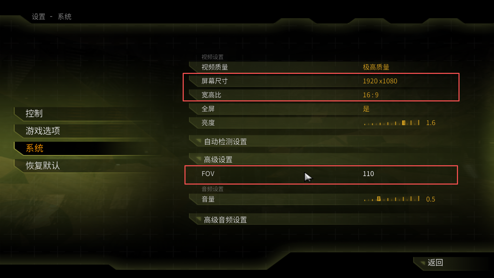
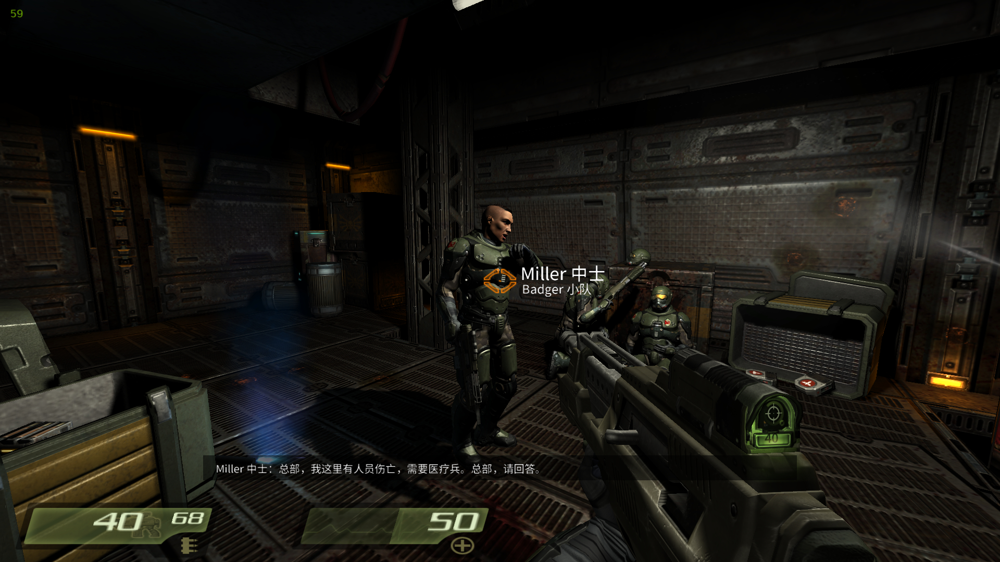

[简体中文](README.md) | [English Version](README_EN.md)

# Quake 4 简体中文汉化




一份完整的 Quake 4（2005）简体中文汉化补丁：全部界面/菜单/剧情对白翻译、原版本没有的**语音字幕**（含无线电通讯与 PA 广播）、思源黑体中文字体、Strogg 外星文与神经细胞植入后可读文的完整中文化。

基于 [idTech4A++](https://github.com/glKarin/com.n0n3m4.diii4a) 开源引擎（GPL），运行时不修改玩家的原版游戏目录。

仓库以 `Quake4-Translate-Subtitle` 为统一名称。安装器提供两种互斥模式：**完整简体中文汉化**（菜单+字幕全中文），或 **英文原版 + 英文字幕**（保留原版英文界面和字体，只增加原版没有的语音字幕）。

---

## 特性

- **翻译覆盖率**：UI 2272 条 + 剧情对白 5100+ 条 + 无线电/PA 251 条 + AI 台词补齐 668 条 + 原版缺失 lipSync decl 批量补齐 89 条，术语表统一定稿
- **字幕系统**：原版无字幕；本汉化在 DLL 层挂钩 `idAI::Speak`、`idFuncRadioChatter`、`idSound::DoSound(play)`、`Event_StartSound` 输出实时字幕，含说话人前缀（无线电/广播/士兵/角色名）和五色配色（角色白/无线电青/Strogg 广播黄/舰船广播绿/Makron 紫）
- **可听性门控**：默认根据距离与 PVS 过滤远处/隔墙 NPC 的字幕（友军放宽、PA 广播豁免距离门控），避免"隔屋字幕刷屏"
- **引擎修复**：Hub1 Sentry 物理故障掉帧修复、过场对话字幕门控修复、实体模型射击表面类型修复（生命补给器/尸体喷血而非冒火花）
- **CJK 字体自渲染**：自研 `export_font.py`（bearing 烘位图、真 advance、宽表按 GB2312+游戏实用字裁剪、2x 超采样、按 16:9 预压缩宽高比）替代引擎 `exportFont` 的三个已知缺陷
- **Strogg 外星文**：改造前终端全部原版外星符号（CJK 稳定映射到 62 个字母/数字符号）；改造后神经细胞植入的转译动画中文化（外星符号逐字解码成中文"神经细胞已植入"）
- **存档兼容**：所有 gui 覆盖只改数值不动结构，保证与原版存档格式兼容（读档不崩）

---

## 系统要求

- Windows 10/11 64 位
- Quake 4 原版游戏数据，**已升级到 1.4.2 补丁**
  - Steam 版自带 1.4.2，无需处理
  - 光盘/下载版：`q4base` 里必须有 `pak021.pk4` 与 `pak022.pk4`；没有就先装官方 1.4.2 补丁
- 使用图形安装器无需另装 Python；仅维护者使用 `postinstall.cmd` 便携流程时需要 Python 3.9 或更新版本
- 显示器分辨率建议 16:9（默认字体按 16:9 校准；4:3 / 21:9 需重导字体，见 [wiki](#非-169-分辨率)）

---

## 快速开始（3 步）

### 1. 下载

从 [Releases](https://github.com/hazzzzzy/Quake4-Translate-Subtitle/releases) 下载最新的 `Quake4-Chinese-Installer-vX.Y.Z.exe`。这是内含引擎和汉化公开资产的单文件安装器，下载后可直接运行，无需再下载或解压 ZIP。

`Quake4-Translate-Subtitle-vX.Y.Z.zip` 保留为完整便携包，供维护者和需要手动部署的用户使用。

如果你没有 Release 包也可以直接：

```bash
git clone https://github.com/hazzzzzy/Quake4-Translate-Subtitle.git
cd Quake4-Translate-Subtitle\dist
```

`dist/` 目录包含图形安装器及其汉化资源。

### 2. 首次安装

1. 双击下载的 `Quake4-Chinese-Installer-vX.Y.Z.exe`。
2. 确认自动识别的 Quake 4 1.4.2 游戏目录，或点“浏览”自行选择。
3. 选择安装模式：
   - **完整简体中文汉化**（默认）：菜单、HUD、剧情文本与字幕全部中文
   - **英文原版 + 英文字幕**：界面、字体保持原版英文，只添加语音字幕
4. 按需勾选“创建桌面快捷方式”，然后点“安装汉化”。

   中文模式会从玩家自己的 `pak001.pk4 / pak014.pk4 / pak021.pk4 / zpak_english*.pk4` 现场生成不随汉化分发的运行资产（约 1–3 分钟）：
   - Strogg 外星文字体（原版）
   - HUD 无线电两行 rect 数值补丁
   - 神经细胞植入转译动画（中文化）
   - 中文语音路径别名 pk4（英文原声）

   英文字幕模式为纯静态部署，数秒完成，无现场生成步骤。两种模式可先后安装并共存。原版 EXE 和原版 `q4base` 文件始终保持原样。

### 3. 启动

双击游戏目录中的 `Quake4中文启动器.exe`（中文模式）或 `Quake4英文字幕启动器.exe`（英文模式），或使用安装时创建的桌面快捷方式。

需要便携目录的维护者仍可使用 `dist\postinstall.cmd` 和 `dist\启动汉化版.cmd` 手动部署。

---

## 详细说明

### 存档

- 图形安装模式的存档位于 `<游戏目录>\Quake4-Chinese\savedata\q4base\savegames\`（中文版）与 `<游戏目录>\Quake4-Chinese\savedata-english\q4base\savegames\`（英文字幕版）
- 原版、中文版、英文字幕版使用各自独立的 `fs_savepath`，三套存档互不影响
- 安装器的“存档管理”会分别显示三套存档的数量和最近更新时间，可打开目录或备份到 `<游戏目录>\Quake4-Chinese\save-backups\`
- 便携模式的存档仍位于 `dist\savedata\q4base\savegames\`

### 常见问题

| 现象 | 处理 |
|---|---|
| 提示 `pak021.pk4 missing` | 你的 Quake 4 不是 1.4.2 版本，先装官方 1.4.2 补丁；Steam 版本无此问题 |
| Strogg 终端全是问号 | 重新运行图形安装器；便携模式则重新运行 `postinstall.cmd` |
| NPC 说话没字幕 | 该角色在原版可能无对应 lipsync decl；本汉化已补 668 条 AI decl，如仍缺失请提 issue 附上 `savedata\q4base\qconsole.log` |
| 崩溃 | `savedata\q4base\qconsole.log` 有崩溃前的所有日志，附 issue 里 |
| HUD 数字被顶部截掉 | 用户的自定义 gui 覆盖或旧字体残留：删掉 `savedata\q4base\fonts\chinese\`+`guis\hud.gui` 后重跑 postinstall |

### 控制台常用变量

按 `~` 呼出控制台。

| 命令 | 说明 |
|---|---|
| `harm_g_subtitles 0` | 关闭字幕（默认 1 开启） |
| `harm_g_subtitleHoldTime 3.0` | 字幕停留时间（秒，默认 2.5） |
| `harm_g_subtitleMinTime 1.0` | 短句最小显示时长（秒，默认 0.8） |
| `harm_g_subtitlePVSCheck 0` | 关闭 PVS 隔墙过滤（默认 1，远处/隔墙 NPC 字幕会被过滤） |
| `harm_g_subtitleDebug 1` | 打印字幕决策日志（`[SUB] …`），排查为何没字幕 |
| `harm_r_softStencilShadow 0` | 关闭软阴影（低端显卡用；启动器已默认关） |

### 非 16:9 分辨率

字体按 16:9 校准（横向预压缩 0.75 抵消引擎 640×480 → 16:9 拉伸）。**4:3、21:9 屏需要重导字体**：

```bash
# 编辑 src\tools\export_font.py，把 ASPECT 改成 (4/3)/(你的屏宽/屏高)
# 例：21:9 (2560x1080) → ASPECT = (4/3)/(2560/1080) = 0.5625
python src\tools\export_font.py
# 产物会覆盖工程根 savedata\q4base\fonts\chinese\；
# 拷到 dist\savedata\q4base\fonts\chinese\ 即可
```

---

## 项目结构

```
Quake4-Translate-Subtitle/
├── README.md              — 本文
├── LICENSE                — GPL-3.0（主要许可）
├── LICENSE-FONTS.txt      — 思源黑体 SIL OFL 1.1
├── CHANGELOG.md
├── docs/
│   ├── glossary.md               — 术语表（专名/军衔/武器/小队名定稿）
│   └── localization-guide.md     — 汉化制作流程指南（方法论）
├── dist/                  — 可运行汉化根目录
│   ├── Quake4-Chinese-Installer.exe — 图形安装器
│   ├── engine/            — idTech4A++ 引擎 + 自研 q4game.dll
│   ├── savedata/q4base/   — 松散覆盖资产
│   │   ├── fonts/chinese/       — 思源黑体自渲染 UI 家族字体
│   │   ├── strings/             — 5 个中文 lang 文件
│   │   ├── guis/subtitles.gui   — 字幕面板
│   │   ├── lipsync/             — 补齐的 radio/AI 台词 decl
│   │   └── materials/           — 材质别名（同源字体共享贴图）
│   ├── 启动汉化版.cmd
│   ├── postinstall.cmd    — 首次安装（补齐版权敏感物）
│   └── README.txt         — 中文简易说明
└── src/                   — 源码 / 维护者工具
    ├── translations/            — 翻译主表（TSV）
    ├── tools/                   — Python 工具链
    │   ├── build_lang.py             生成部署 lang
    │   ├── export_font.py            自研宽字库导出器（替代引擎 exportFont）
    │   ├── patch_hud.py              hud.gui 数值补丁（维护者用）
    │   ├── gen_radio_decls.py        无线电 lipsync decl 生成
    │   ├── build_dist_extras.py      postinstall 后台主体
    │   └── ...
    ├── installer/               — 图形安装器与原生启动器源码
    └── engine-patches/          — diii4a 引擎侧改动
        ├── 0001-quake4-cn-runtime.patch    — 8 个文件差量
        ├── Subtitles.h                     — 字幕系统头
        └── Subtitles.cpp                   — 字幕系统实现
```

---

## 从源码构建/维护

### 生成部署 lang

改完 `src/translations/*.tsv` 后：

```bash
python src/tools/build_lang.py
```

### 重导字体

改字体源（`export_font.py` 里的 `UI_TTF`）或字符集后：

```bash
python src/tools/export_font.py
```

产出在工程根 `savedata\q4base\fonts\chinese\`。

### 重编 q4game.dll

1. 克隆 `com.n0n3m4.diii4a` 并切到 `v1.1.0harmattan70` tag：

   ```bash
   git clone https://github.com/glKarin/com.n0n3m4.diii4a.git
   cd com.n0n3m4.diii4a
   git checkout v1.1.0harmattan70
   ```

2. 应用本仓库补丁：

   ```bash
   git apply /path/to/Quake4-Translate-Subtitle/src/engine-patches/0001-quake4-cn-runtime.patch
   cp /path/to/Quake4-Translate-Subtitle/src/engine-patches/Subtitles.{h,cpp} \
      Q3E/src/main/jni/doom3/neo/quake4/
   ```

3. 用 CMake + VS2022 生成 `q4game.dll`（`-DCORE=OFF -DBASE=OFF -DRAVEN=OFF -DQUAKE4=ON`）；参见 `src/engine-patches/README.md`。

### 自动验证与打包

- push 到 `main`会运行测试、上游补丁校验、安装器构建和分发审计，并上传单文件 EXE、ZIP 与校验文件 Artifact。
- push `v*`标签会在验证通过后创建 GitHub Release，同时提供可直接运行的版本化 EXE 和便携 ZIP。
- 本地可运行 `src\tools\package_release.ps1 -Version dev`生成同结构 EXE、ZIP 与校验文件。

---

## 版权与许可

汉化补丁**不包含**任何 Raven Software / id Software 的原版游戏数据。玩家必须自己合法拥有 Quake 4 原版游戏。

| 组件 | 许可 | 说明 |
|---|---|---|
| 引擎 `dist/engine/Quake4.exe`、`q4game.dll` 及自研 DLL 源码 | **GPL-3.0** | 派生自 [idTech4A++](https://github.com/glKarin/com.n0n3m4.diii4a)（GPL） |
| 翻译文本（`dist/savedata/q4base/strings/`、`src/translations/`） | **CC BY-NC-SA 4.0** | 非商业署名相同方式共享 |
| CJK 字体位图（`dist/savedata/q4base/fonts/chinese/*.tga`+`.fontdat`） | **SIL OFL 1.1** | 派生自[思源黑体](https://github.com/adobe-fonts/source-han-sans) Medium（Adobe/Google，OFL） |
| Python 工具链、gui、lipsync decl、材质别名 | **GPL-3.0** | 便于 idTech4 家族其他项目复用 |
| 用户运行 `postinstall.cmd` 就地生成的补齐物（`strogg_*` 字体、`hud.gui`、`med1_textchange.gui`、`zzz_vo_chinese_alias.pk4`） | 用户合法所有 | 派生自玩家自己的原版数据；不在本仓库分发 |

**Quake 4** 是 id Software / Raven Software 的商标。本项目为爱好者非商业性汉化，与 id / Raven / Bethesda / ZeniMax 无关。

---

## 致谢

- [glKarin (n0n3m4)](https://github.com/glKarin) — `idTech4A++` 引擎移植与维护
- Adobe / Google — 思源黑体 Medium
- Quake4[CC] 听障模组作者（archive.org 快照）— 无线电 PA 转写来源

---

## 相关资源

- **汉化制作方法论**：[`docs/localization-guide.md`](docs/localization-guide.md)（从零做一个 idTech4 家族游戏中文汉化的完整流程）
- **术语表**：[`docs/glossary.md`](docs/glossary.md)（专名/军衔/武器/小队名定稿）
- **上游引擎**：[com.n0n3m4.diii4a](https://github.com/glKarin/com.n0n3m4.diii4a)
